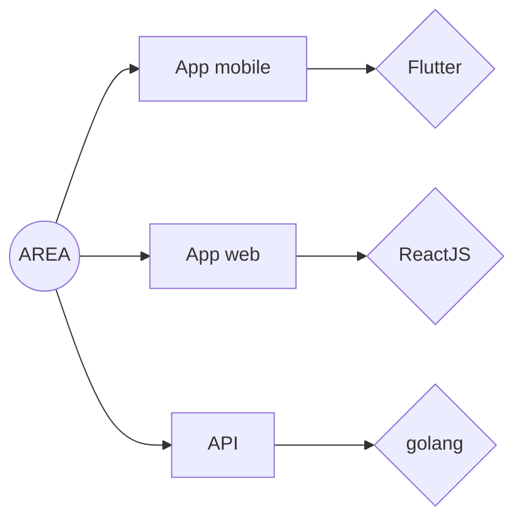
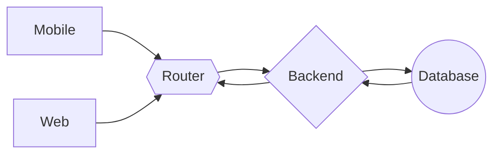

# Overview

This project is an automation platform between APIs. On a website usable on both mobile devices and classic PCs, you can create an account to select **actions** and **reactions**.

# Detailed explication

What is an **action** ? What is a **reaction** ?

## Action

An **action** is a [webhook](https://www.redhat.com/en/topics/automation/what-is-a-webhook) that will start a dedicated **reaction**.

### Some examples

- Weather action : triggering a reaction when the temperature in a specific city is below or above a specific number.
- Covid action : triggering a reaction when the covid cases or critical cases are over a given number.
- Crypto current : triggering a reaction when a choosen crypto is over or under a given number.

## Reaction

A **reaction** is a component activated by an **action** : these components perform a specific task by activating a **trigger**.

### Some examples 

- Deezer service : adding a specific song to a specific playlist.
- Discord service : sending a specific message in a specific channel.
- Spotify service : adding a specific song to the user's queue.

You can link action and reactions through the *wallet* page.

# Specs

The project is divided in three parts :
- An application server
- A web client
- A mobile client

<!-- @cond -->

## Languages

## API description

<!-- @endcond -->

# about.json

The `about.json` is a file that contains informations about the client and the server (including active services).

This means that all active actions and reactions with their own descriptions are stored in this file.

The application server answers the call `http://localhost:8080/about.json` that leads to this file.  

***

# Our team

Developers  

| [ [Axel Zenine]](https://github.com/Azzzen) | [ [Erwan Simonetti]](https://github.com/ErwanSimonetti) | [ [Juliette Destang]](https://github.com/JulietteDestang) | [ [Timothée De Boynes]](https://github.com/HKtueur1) | [ [Martin Blancho]](https://github.com/BlanchoMartin)
| :---: | :---: | :---: | :---: | :---: |
